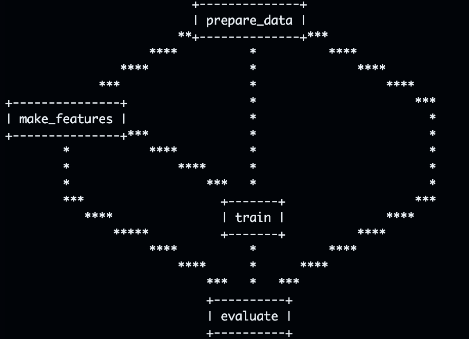
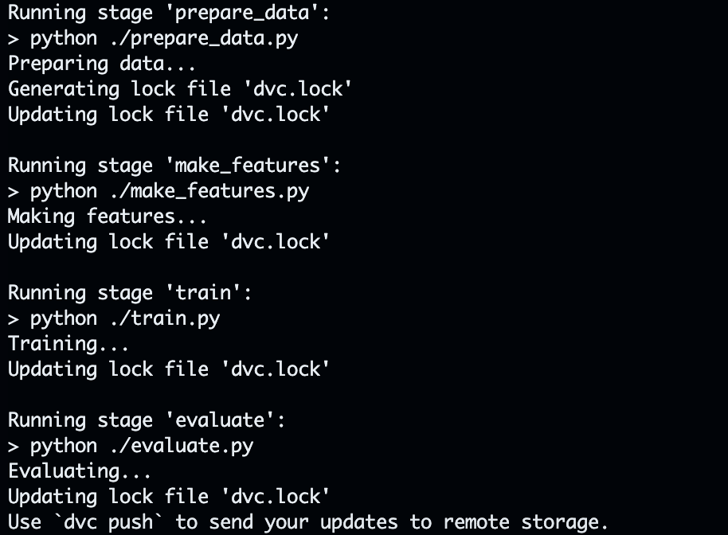

# ML Pipeline using DVC

## Overview

This repository demonstrates a Machine Learning (ML) pipeline using Data Version Control (DVC) to efficiently manage and reproduce the entire workflow. The pipeline consists of four main stages: `prepare_data`, `make_features`, `train`, and `evaluate`. Each stage contributes to the end-to-end process of training and evaluating a machine learning model.

## Getting Started

### Prerequisites

Ensure you have the following dependencies installed:

```bash
pip install pandas joblib scikit-learn omegaconf
```

### Initializing the Project

```bash
git init
dvc init
```

## Pipeline Overview

To visualize the complete Directed Acyclic Graph (DAG) of the pipeline, use the following command:

```bash
dvc dag
```



## Running the Pipeline

Execute the following command to reproduce the pipeline:

```bash
dvc repro
```



This will run the necessary stages based on the dependencies, ensuring that only changed components and their dependencies are re-executed.

## DVC Features and Benefits

Data Version Control (DVC) provides several features and benefits that enhance the development and management of ML pipelines:

1. **Caching Unchanged Parts**: DVC intelligently caches the unchanged parts of the pipeline, preventing unnecessary recomputation. This significantly speeds up the development process.

2. **Dependency Tracking**: DVC tracks all components and their dependencies, allowing for precise identification of changes. It ensures that only the necessary parts of the pipeline are rerun when something is modified.

3. **Efficient and Automated Development**: With DVC, development becomes more efficient and automated. Developers can focus on modifying and experimenting with specific components without the need to rerun the entire pipeline.

## OmegaConf and Parameter Configuration

OmegaConf is used to manage configuration parameters, allowing easy experimentation and fine-tuning without altering the code.

1. **Parameters Configuration**: Define parameters in the `params.yaml` file, making it simple to experiment with different configurations.

2. **Flexible and Dynamic Configuration**: OmegaConf enables dynamic configuration updates, enhancing the flexibility of the pipeline.

## Contributing

Feel free to contribute to this project by forking and submitting a pull request. For major changes, please open an issue to discuss the proposed changes.
